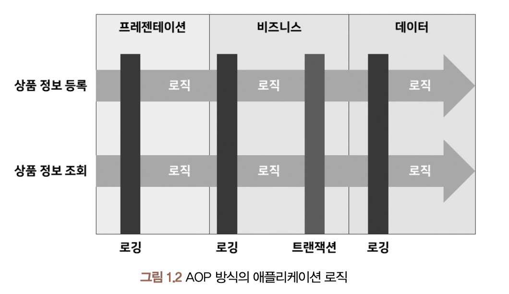
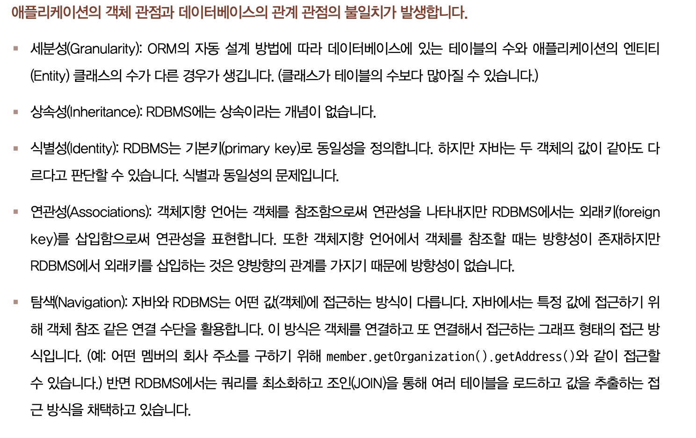
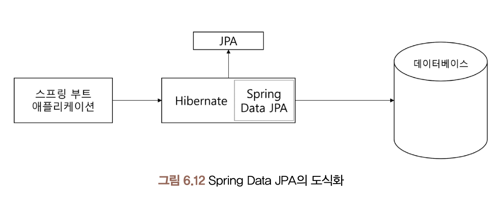

### 관점 지향 프로그래밍(AOP)

- 관점을 기준으로 묶어 개발하는 방식.
- 관점(Aspect)이란 어떤 기능을 구현할때 ‘핵심 기능’과 ‘부가 기능’으로 구분해 각각을 하나의 관점으로 보는 것을 의미한다.
- 핵심기능: 비즈니스 로직을 구현하는 과정에서 비즈니스 로직이 처리하려는 목적 기능

    - 예) 상품 정보 데이터베이스에 저장, 저장된 데이터를 보여주기
- 부가기능: 로깅처리, 트랜젝션 처리 등
  

### Object Relational Mapping

* 객체지향 언어에서 클래스와 RDB의 테이블을 연결하는 방법
* 클래스 자체는 테이블과 매핑하기 위해 만들어진 것이 아니기 때문에 불가피한 불일치 발생.

장점

* 데이터베이스 쿼리를 객체지향적으로 조작 가능
* 재사용 유지보수 편리
* 특정 데이터베이스에 종속성 줄어듬

단점

* 복잡한 쿼리 구현 어려움, 성능저하
* 어플리케이션 객체 관점과 DB 관계 관점의 불일치 발생
  * 세분성(Granularity)
  * 상속성(Inheritance)
  * 식별성(Identity)
  * 연관성(Association)
  * 탐색(Navigation)

### JPA(Java Persistence API)

* 자바 ORM 기술 표준. 인터페이스 모음. ORM이 큰 개념이라면 JPA는 구현체 스펙
* 인터페이스라 실체 구현체는 아니고 어떻게 동작해야하는지 매커니즘을 정리한 표준 명세
* JPA가 JDBC 사용. 개발자 대신 SQL 만들고 객체 매핑 해줌.
* 대표적인 구현체로 Hibernate, EclipseLink

### Hibernate

* 자바 ORM 프레임워크. JPA 구현체

### Spring Data JPA

* Hibernate를 간편하게 사용하도록 해주는 하위 라이브러리

### 영속성 컨텍스트(Persistence Context)

* 애플리케이션과 데이터베이스 사이에서 엔티티와 레코드의 차이를 해소하고 객체를 보관해주는 기능
* 엔티티 객체가 영속성 컨텍스트에 들어오면 JPA는 이들의 매핑 정보를 데이터베이스에 반영

### 엔티티 매니저

* 엔티티를 관리하는 객체. 데이터베이스에 접근해서 CRUD 수행
* Spring Data JPA 에서는 레포지토리가 엔티티매니저 사용. 즉 레포지터리는 데이터베이스에 접근해서 CRUD 수행 하는데 사용된다.
* 엔티티 매니저 팩토리: 데이터베이스에 대응하는 객체. 엔티티 매니저 생성

### 엔티티 생명주기
* 비영속(New)
* 영속(Managed)
* 준영속(Detached)
* 삭제(Removed)

### DAO
* 개념: 스프링에서 데이터베이스에 접근하기 위한 객체. SpringData JPA 사용시 레포지터리랑 비슷.
* 규모가 작은 곳에서는 레포지터리가 DAO 대체. 서비스레이어에서 바로 레포지터리 사용해서 데이터베이스 접근하기도함.

### 객체의 동등성, 동일성
* equals: 두 객체의 내용이 같은지(동등성) 검사
* hashCode: 두 객체가 같은 객체인지(동일성) 검사

